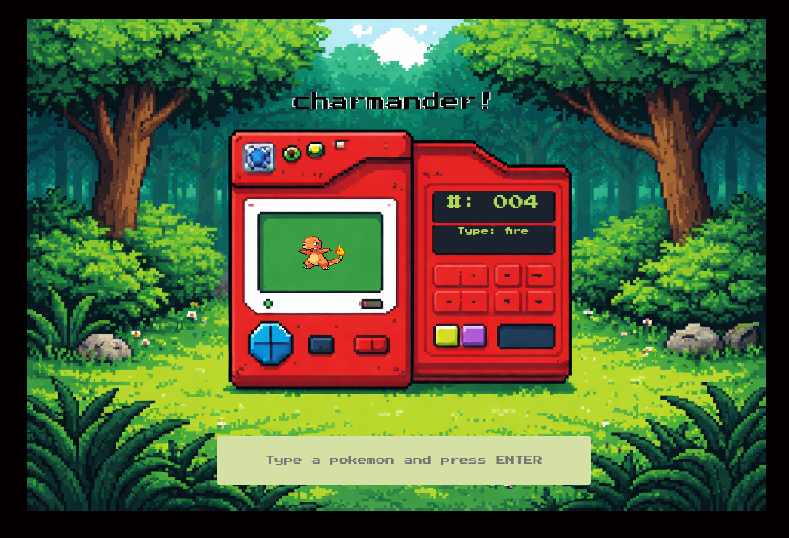

  

<h3 align="center">Pokédex API</h3>

   

---

 A basic project to uderstand how to gather data from and API and display for the user. Just type in the pokemon (spelled correctly) , and hit enter to see some info the a picture of that pokemon!
      

## 📝 Table of Contents
- [About](#about)

- [Deployment](#deployment)

- [Built Using](#built_using)

## 🧐 About 
This project was built as part of The Odin Project, where the original goal was to create a weather app to practice working with APIs. Instead, I decided to have a little fun with it and build an API-powered Pokédex. The app fetches data for a Pokémon and displays its name, Pokédex number, and type in a simple, interactive interface. This approach let me stay aligned with the learning objectives while working on something I genuinely enjoy.

Through this project, I gained hands-on experience using the fetch API to retrieve data from an external source and handling that data asynchronously with Promises. I learned how to structure API requests, process JSON responses, and update the DOM dynamically based on the results. Overall, this project helped solidify my understanding of working with APIs and asynchronous JavaScript while reinforcing good project structure and problem-solving skills.

## 🚀 Deployment 
Deployment is simple! [Click Here](https://wlewis0991.github.io/PokemonAPI/)

## ⛏️ Built Using 

